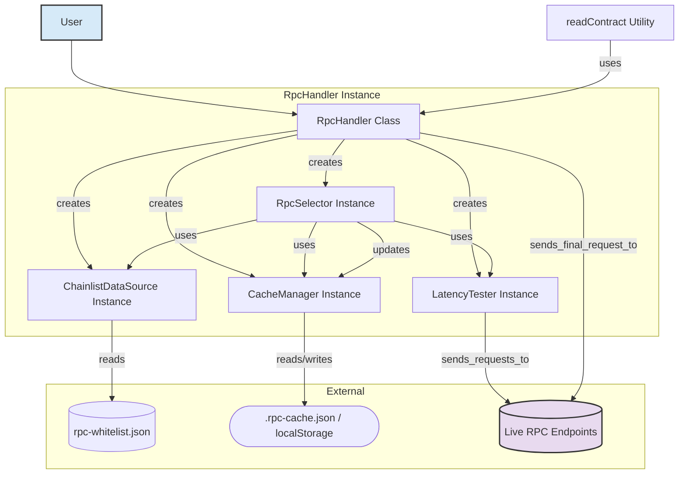

# Distilled Context: RPC Handler Rewrite (End of Session Summary)

This document summarizes the state, architecture, and key decisions of the RPC Handler project at the end of the current development session. It aims to provide a comprehensive overview for continuation.

*(Note: This differs from `active-context.md`, which tracks the immediate focus and recent changes during ongoing work.)*

## 1. Recent Key Updates

-   **RPC Selection Enhancement:** Improved RPC selection logic to better handle nodes with incorrect Permit2 bytecode:
    -   Now prioritizes: ok > wrong_bytecode > syncing
    -   Allows basic operations to work on any responsive RPC
    -   Maintains strict checks only for Permit2-specific operations
-   **Bytecode Validation:** Enhanced understanding of Permit2 bytecode checking:
    -   Uses first 13995 bytes for exact comparison
    -   Tolerates deployment differences across chains
    -   Added detailed logging for bytecode mismatches

## 2. Project Goal & Core Problem Solved

-   **Goal:** Create an intelligent RPC handler that automatically selects the fastest, *valid* RPC for EVM chains, abstracting complexity and improving reliability/performance compared to manual endpoint management.
-   **Problem:** Public RPCs are often unreliable, slow, or out-of-sync. Managing them manually is complex.

## 2. Final Architecture & Components (`src/`)

-   **`ChainlistDataSource`:** Reads RPC URLs from `src/rpc-whitelist.json`. Filters for valid HTTPS URLs initially.
-   **`LatencyTester`:**
    -   Tests URLs provided by `RpcSelector`.
    -   Performs concurrent `eth_getCode` (for Permit2 bytecode prefix from `src/permit2-bytecode.ts`) and `eth_syncing` calls.
    -   Returns detailed `LatencyTestResult` map: `{ url: string, latency: number, status: 'ok' | 'syncing' | 'wrong_bytecode' | 'timeout' | 'http_error' | 'rpc_error' | 'network_error', error?: string }`. Latency is `Infinity` on failure.
-   **`CacheManager`:**
    -   Stores the `LatencyTestResult` map and the selected `fastestRpc` URL per chain.
    -   Uses `.rpc-cache.json` (Node.js) or `localStorage` (browser). Detects environment via `typeof window`/`typeof process`.
    -   Default TTL is 1 hour (configurable via `RpcHandler` options).
-   **`RpcSelector`:**
    -   Orchestrates selection. Checks cache first (respecting TTL for `fastestRpc` but allowing potentially stale `latencyMap` for fallback).
    -   If cache miss/invalid, gets URLs from `DataSource`, triggers `LatencyTester`.
    -   **Selection Logic (Dynamic Leniency):**
        1.  Finds fastest RPC with `status: 'ok'`.
        2.  If none, finds fastest RPC with `status: 'syncing'`.
        3.  Never selects `status: 'wrong_bytecode'` or other errors.
        4.  Returns `null` if no suitable RPC found.
    -   Updates cache with full test results and selected RPC (if any).
    -   Provides `findNextFastestRpc` using the same priority logic on the cached map.
-   **`RpcHandler`:**
    -   Main entry point. Instantiates dependencies.
    -   `send(chainId, method, params)`: Gets fastest RPC from `RpcSelector`, executes call via `fetch`. On failure, calls `findNextFastestRpc` and retries once.
-   **`contract-utils.readContract`:**
    -   Helper function exported from `src/index.ts`.
    -   Uses `viem` (`encodeFunctionData`, `decodeFunctionResult`).
    -   Requires user-provided `abi`.
    -   Calls `handler.send` to perform the underlying `eth_call`.

## 3. Key Decisions & Trade-offs

-   **Whitelist Approach:** Adopted over using the full Chainlist due to the high failure rate of public RPCs against strict checks during live testing. Requires maintaining `src/rpc-whitelist.json`.
-   **Strict Checks Maintained:** Permit2 bytecode check (`eth_getCode`) and sync check (`eth_syncing`) are mandatory for an RPC to have `status: 'ok'`.
-   **Dynamic Leniency:** Implemented fallback to allow using RPCs that pass the critical bytecode check but are currently syncing (`status: 'syncing'`) *only if* no fully 'ok' RPCs are available. This balances reliability with availability.
-   **Detailed Caching:** Cache stores the full `LatencyTestResult` map, preserving failure reasons for potential analysis or future blacklist implementation, even if a lenient selection was made.
-   **Manual ABI Provision:** `readContract` requires users to provide ABIs, avoiding the complexity and dependency issues of dynamic fetching (e.g., Etherscan API).
-   **Testing Strategy:** Unit tests use mocks (`tests/rpc-handler.test.ts`, `tests/contract-utils.test.ts`). Integration-style tests use real data source but mocked network (`tests/rpc-selector.test.ts`, `tests/latency-tester.test.ts`). The previous mocking issues with `RpcSelector` were resolved by using the real `ChainlistDataSource`.

## 4. Current Status & Next Steps

-   Core functionality implemented and documented (`docs/`, `README.md`).
-   All 27 tests across 4 files pass (`bun test`).
-   Example code in `src/rpc-handler.ts` demonstrates live usage but is commented out due to public RPC unreliability against strict checks.
-   **Next:** Refinement (error handling, config), improved test coverage, whitelist maintenance, consider write transaction support.
