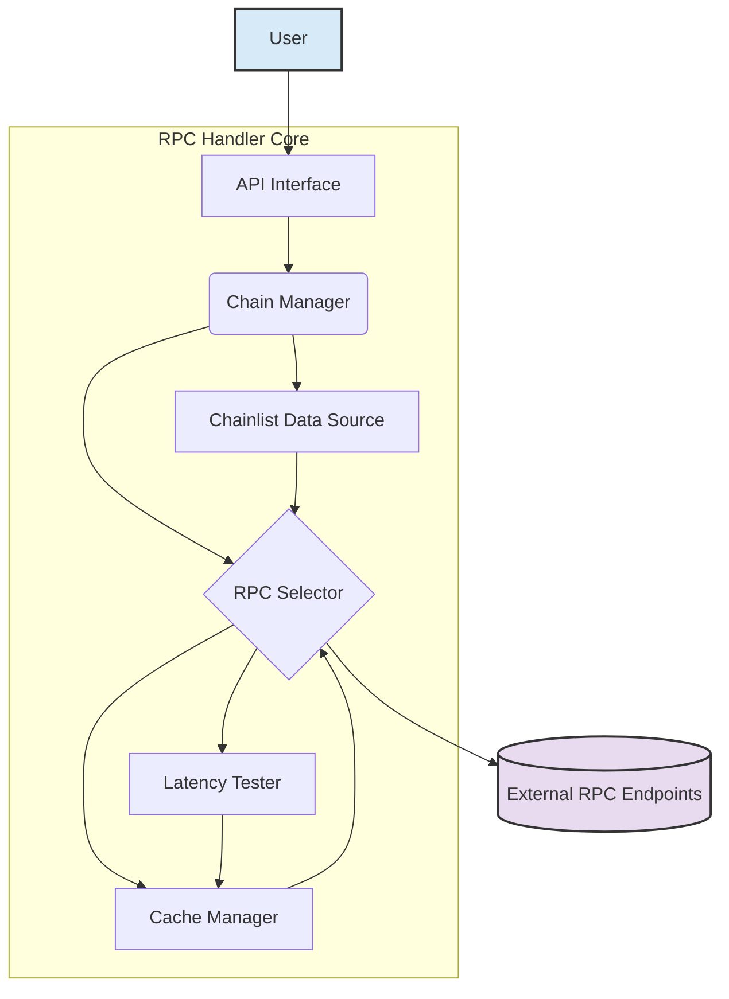

# System Patterns: RPC Handler Rewrite

## 1. High-Level Architecture

The rewritten RPC handler will consist of several key components working together:

## 2. Component Descriptions

-   **API Interface:** The public-facing interface for the handler. It will expose methods for making RPC calls (e.g., `send(chainId, method, params)`). It abstracts the underlying complexity from the user.
-   **Chain Manager:** Responsible for managing information about different blockchain networks (Chain IDs, known RPC endpoints).
-   **Chainlist Data Source:** Responsible for fetching and potentially updating the list of RPC endpoints from Chainlist. It filters for free endpoints and provides this data to the `RPC Selector`. This might involve fetching a pre-generated list or interacting with the Chainlist API/data source directly.
    -   **Latency Tester:** Periodically tests the response time and validity of whitelisted RPC endpoints:
        - Tests Permit2 bytecode (first 13995 bytes) via `eth_getCode`
        - Checks sync status via `eth_syncing`
        - Returns detailed results including:
          - `ok`: Fully synced with correct bytecode
          - `wrong_bytecode`: Synced but incorrect Permit2 bytecode
          - `syncing`: Node is still syncing
          - Error states: `timeout`, `http_error`, `rpc_error`, `network_error`
    -   **Cache Manager:** Stores the detailed `LatencyTestResult` map and the currently selected fastest valid RPC endpoint for each chain. Uses `localStorage` (browser) or a JSON file (Node.js) for persistence.
    -   **RPC Selector:** The core logic unit. For a given `chainId`:
    1.  Checks the cache for the current fastest RPC.
    2.  If not cached or cache is stale, consults the `Chainlist Data Source` for available free endpoints.
    3.  Triggers the `Latency Tester` if needed (cache miss/expired).
    4.  Uses latency results (from cache or tester) to select the fastest endpoint in order of preference:
        1. RPCs with `status: 'ok'` (fully compliant)
        2. RPCs with `status: 'wrong_bytecode'` (for basic operations)
        3. RPCs with `status: 'syncing'` (last resort)
        4. No selection if all RPCs have critical errors
    5.  Updates the cache with the detailed results and the selected endpoint (if any) via the `Cache Manager`.
    6.  Returns the selected RPC endpoint URL (or null) to the `RpcHandler`.

## 3. Key Design Patterns

-   **Strategy Pattern:** The `RPC Selector` uses a compound strategy:
    - Primary: RPC status tier (ok > wrong_bytecode > syncing)
    - Secondary: Fastest latency within each tier
    - Future: Could add more strategies (round-robin, paid tiers)
-   **Caching:** Used extensively to avoid redundant latency tests and provide quick endpoint selection.
-   **Abstraction:** The `API Interface` hides the internal workings of endpoint selection and testing.
-   **Modular Design:** Components are designed with distinct responsibilities, allowing for easier testing, maintenance, and potential future extensions.

## 4. Data Flow (Simplified Request)

1.  User calls `handler.send(chainId, method, params)`.
2.  `API Interface` passes the request to `Chain Manager`.
3.  `Chain Manager` asks `RPC Selector` for the best endpoint for `chainId`.
4.  `RPC Selector` checks `Cache Manager`.
    -   If valid cache entry exists, returns cached endpoint URL.
    -   If not, fetches endpoints from `Chainlist Data Source`, triggers `Latency Tester`, determines fastest, updates cache via `Cache Manager`, and returns the fastest endpoint URL.
5.  `Chain Manager` (or `API Interface`) uses the returned URL to make the actual RPC call.
6.  Result (or error) is returned to the user.
