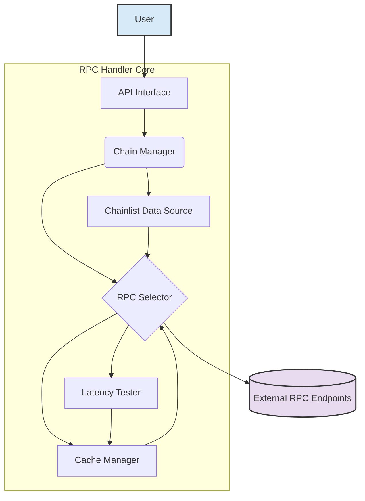

# System Patterns: RPC Handler Rewrite

## 1. High-Level Architecture

The rewritten RPC handler will consist of several key components working together:

## 2. Component Descriptions

-   **API Interface:** The public-facing interface for the handler. It will expose methods for making RPC calls (e.g., `send(chainId, method, params)`). It abstracts the underlying complexity from the user.
-   **Chain Manager:** Responsible for managing information about different blockchain networks (Chain IDs, known RPC endpoints).
-   **Chainlist Data Source:** Responsible for fetching and potentially updating the list of RPC endpoints from Chainlist. It filters for free endpoints and provides this data to the `RPC Selector`. This might involve fetching a pre-generated list or interacting with the Chainlist API/data source directly.
-   **Latency Tester:** Periodically tests the response time of available RPC endpoints for relevant chains. Uses a lightweight RPC call (e.g., `eth_blockNumber`) to measure latency.
-   **Cache Manager:** Stores the results of latency tests and the currently determined fastest RPC endpoint for each chain. Uses `localStorage` (for browser environments) or a suitable alternative (for backend environments) to persist this information within a session or across sessions.
-   **RPC Selector:** The core logic unit. For a given `chainId`:
    1.  Checks the cache for the current fastest RPC.
    2.  If not cached or cache is stale, consults the `Chainlist Data Source` for available free endpoints.
    3.  Triggers the `Latency Tester` if needed (e.g., first call in a session, or periodically).
    4.  Uses latency results (from cache or tester) to select the fastest endpoint.
    5.  Updates the cache via the `Cache Manager`.
    6.  Returns the selected RPC endpoint URL to the `Chain Manager` or `API Interface` to execute the actual call.

## 3. Key Design Patterns

-   **Strategy Pattern:** The `RPC Selector` uses a strategy (fastest latency) to choose an endpoint. This could be extended later with other strategies (e.g., round-robin, paid tiers).
-   **Caching:** Used extensively to avoid redundant latency tests and provide quick endpoint selection.
-   **Abstraction:** The `API Interface` hides the internal workings of endpoint selection and testing.
-   **Modular Design:** Components are designed with distinct responsibilities, allowing for easier testing, maintenance, and potential future extensions.

## 4. Data Flow (Simplified Request)

1.  User calls `handler.send(chainId, method, params)`.
2.  `API Interface` passes the request to `Chain Manager`.
3.  `Chain Manager` asks `RPC Selector` for the best endpoint for `chainId`.
4.  `RPC Selector` checks `Cache Manager`.
    -   If valid cache entry exists, returns cached endpoint URL.
    -   If not, fetches endpoints from `Chainlist Data Source`, triggers `Latency Tester`, determines fastest, updates cache via `Cache Manager`, and returns the fastest endpoint URL.
5.  `Chain Manager` (or `API Interface`) uses the returned URL to make the actual RPC call.
6.  Result (or error) is returned to the user.
