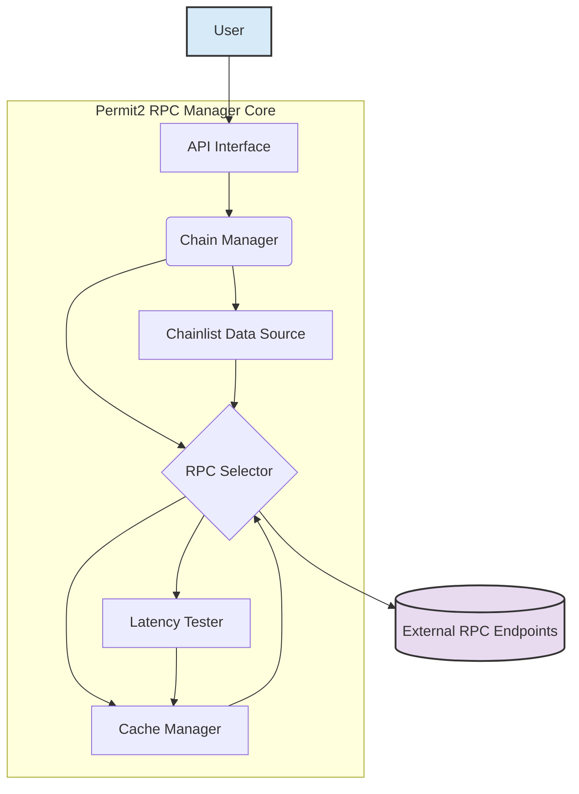

# System Patterns: Permit2 RPC Manager Rewrite

## 1. High-Level Architecture

The rewritten RPC manager will consist of several key components working together:

## 2. Component Descriptions

- **API Interface (`Permit2RpcManager`):** The main class. Exposes the `send` method for making RPC calls and integrates other components. Implements round-robin starting point selection for concurrent requests and iterative fallback logic across available RPCs. Accepts configuration options (timeouts, logging, cache settings, initial RPC data).
- **Chainlist Data Source (`ChainlistDataSource`):** Loads the curated list of RPC endpoints from `src/rpc-whitelist.json` (or accepts initial data). Provides the list of URLs for a given chain to the `RpcSelector`. Now browser-safe by default.
- **Latency Tester (`LatencyTester`):** Tests the response time and validity of whitelisted RPC endpoints when triggered by the `RpcSelector` (typically on cache miss/expiry).
    - *Optimization:* Now performs a single `eth_chainId` call first. If successful and fast, *then* performs `eth_getCode` (for Permit2 bytecode) and `eth_syncing`.
    - Returns detailed results including:
      - `ok`: Fully synced with correct bytecode
      - `wrong_bytecode`: Synced but incorrect Permit2 bytecode
      - `syncing`: Node is still syncing
      - Error states: `timeout`, `http_error`, `rpc_error`, `network_error` (includes CORS failures in browser). Logs expected browser fetch failures at 'debug' level.
- **Cache Manager (`CacheManager`):** Stores the detailed `LatencyTestResult` map for each chain. Uses `localStorage` in browser environments. Node.js file caching is separated into `cache-manager.node.ts` and requires explicit configuration/use. Accepts configuration for TTL and storage keys/paths.
- **RPC Selector (`RpcSelector`):** The core ranking logic unit.
  1.  Provides `getRankedRpcList(chainId)` method.
  2.  Checks `CacheManager` for fresh latency data.
  3.  If cache is stale/invalid, triggers `LatencyTester` (using a locking mechanism to prevent concurrent tests for the same chain).
  4.  Updates cache with new test results and identifies the overall fastest usable RPC.
  5.  Filters out RPCs with error statuses (`timeout`, `network_error`, etc.).
  6.  Sorts the remaining usable RPCs based on status priority (`ok` > `wrong_bytecode` > `syncing`) and then by latency.
  7.  Returns the final sorted list of usable RPC URLs to `Permit2RpcManager`.

## 3. Key Design Patterns

- **Ranking Strategy:** The `RpcSelector` ranks usable RPCs using a compound strategy (status priority then latency).
- **Round-Robin Load Distribution:** The `Permit2RpcManager` selects the *starting* RPC for each new request in a round-robin fashion from the ranked list to distribute load across healthy endpoints during concurrent calls.
- **Iterative Fallback:** The `Permit2RpcManager.send` method iterates through the entire ranked list upon failure, retrying the request on the next available RPC until success or exhaustion.
- **Caching:** Used by `RpcSelector` to store latency test results and avoid redundant tests.
- **Environment-Specific Logic:** Uses build-time defines (`process.env.BUILD_ENV`) and runtime checks (`typeof window`) to separate browser (`localStorage`) and Node.js (file system via `cache-manager.node.ts`) concerns, particularly for caching.
- **Modular Design:** Components remain focused on distinct responsibilities.

## 4. Data Flow (Simplified Request with Failover)

1.  Multiple concurrent calls to `manager.send(chainId, method, params)` are made.
2.  Each `send` call asks `rpcSelector.getRankedRpcList(chainId)`.
3.  `RpcSelector` checks `CacheManager`.
    - If cache is valid, returns cached ranked list.
    - If cache is invalid:
        - Only the *first* call triggers `LatencyTester.testRpcUrls` (due to locking). Other calls wait.
        - `LatencyTester` performs optimized checks (e.g., `eth_chainId` first).
        - Results are used to rank usable RPCs (filtering errors like CORS/timeout).
        - `CacheManager` is updated.
        - The ranked list is returned to all waiting `send` calls.
4.  Each `send` call determines its *starting* RPC from the ranked list using the round-robin index for that `chainId`.
5.  Each `send` call enters its *own* iterative loop, starting from its determined index:
    - It attempts `executeRpcCall` with the current RPC URL.
    - If successful, the loop breaks, and the result is returned.
    - If it fails (network error, RPC error, timeout), it logs a warning and proceeds to the *next* RPC in the ranked list (wrapping around).
6.  If a `send` call's loop completes without any success, a final error is thrown for that specific call.
